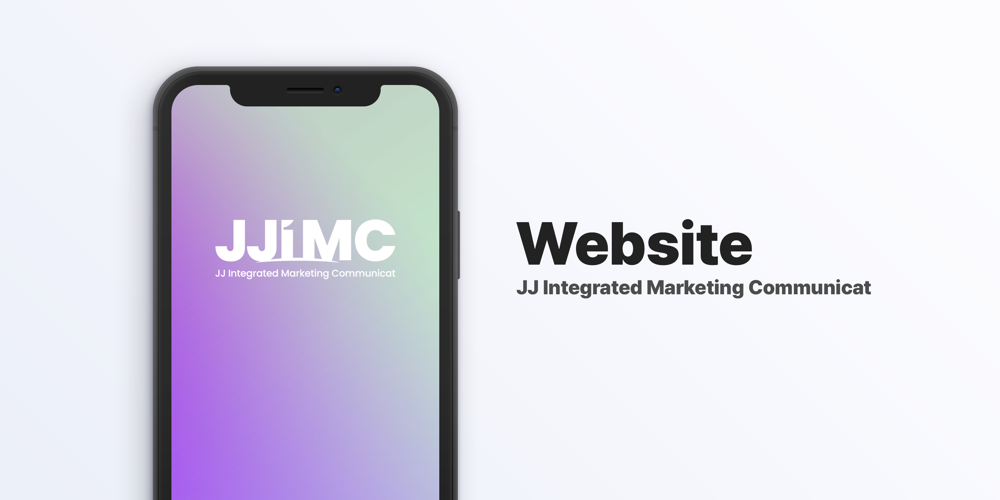

**Disclaimer: This repository includes private assets of JJIMC: JJ Integrated Marketing Communicat, and should not be copied without any permission.**

# jj-imc/website

##  Table of Contents

- [Development](#development)
- [LICENSE](#license)

----

# <a id="development">#</a> Development

We tend to use latest stacks as possible for security and performance.
Currently, we're using Node.JS v16.7 (specified in `sources/.node-version`) and NPM.

To install Node.JS, we recommend [nvm](https://nvm.sh/) and [asdf-vm](https://github.com/asdf-vm/asdf-nodejs) to manage Node.JS versions seamlessly between projects.
All failures due to version mismatching will be not handled.

## Structures

- **assets**, files for repository
- **sources**, remix application

# <a id="license">#</a> License

We're holding our project open-source, but the use of private assets such as logo are prohibited.
All source code excluding private assets is shipped with GPL-3.0 license to protect the company.
